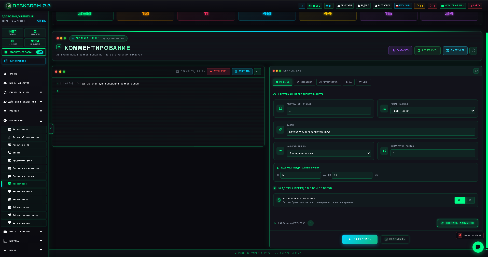
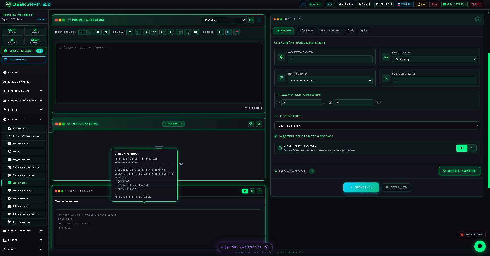
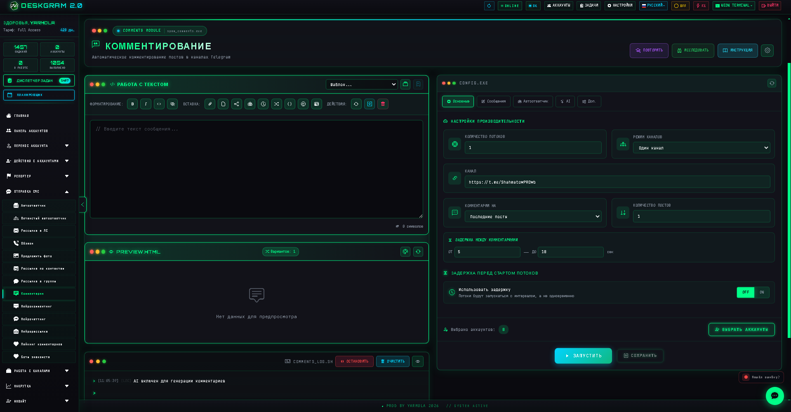
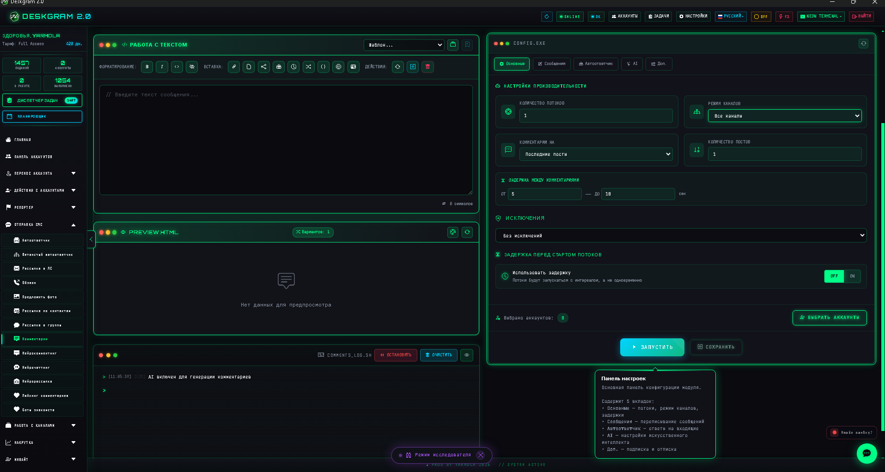

# Комментарные кампании в Telegram через Deskgram 2

Deskgram 2 помогает запускать массовые комментарные кампании в Telegram: работать с площадками, готовить сообщения, распределять аккаунты и выстраивать управляемый engagement-layer. Этот модуль полезен, когда нужно усиливать обсуждения, прогревать комментарные ветки и создавать активность вокруг контента.

[Deskgram 2 Telegram Automation](https://github.com/Deskgram-2/deskgram-2-telegram-automation) • [Сайт](https://deskgram2.com/) • [Telegram-бот](https://t.me/DG2welcomebot) • [Web preview](https://deskgram2.com/web-preview?path=%2Fapp-demo%2Ffunctions%2Fspam_comments&lang=ru)

## Посмотреть модуль в браузере

Если хотите сначала посмотреть интерфейс, откройте [web preview комментарных кампаний](https://deskgram2.com/web-preview?path=%2Fapp-demo%2Ffunctions%2Fspam_comments&lang=ru). Так проще быстро понять, как устроены площадки, сообщения и настройки запуска.

## Скриншоты

## Когда модуль особенно полезен

| Сценарий | Что дает модуль |
|---|---|
| Нужно быстро усилить обсуждения под контентом | Помогает выстроить контролируемую активность |
| Нужен engagement-layer вокруг Telegram-каналов | Создает слой комментарной вовлеченности |
| Нужно связать discovery и outreach | Комментарные кампании могут быть мостом между поиском и дальнейшей работой |
| Требуется более системная работа с комментариями | Убирает ручную рутину и дает единый контур управления |

## Что умеет модуль

- запускать массовые комментарии по выбранным площадкам;
- управлять списком каналов и точек активности;
- собирать сообщения и вариации в одном интерфейсе;
- распределять аккаунты и настройки кампании;
- встраиваться в wider-flow вокруг контента, комментариев и дальнейшего взаимодействия.

## Как обычно строят комментарную кампанию

1. Подбирают площадки, где важна активность под постами.
2. Готовят структуру сообщений и допустимые вариации.
3. Настраивают аккаунты, темп и технические параметры.
4. Запускают первую волну и смотрят на качество engagement.
5. При необходимости усиливают flow через поиск, аудиторию или AI-модули.

## Что подключить рядом

- [Поиск каналов и групп](https://github.com/Deskgram-2/telegram-channel-search-deskgram), чтобы находить новые площадки для комментарной активности;
- [Сбор аудитории из комментариев](https://github.com/Deskgram-2/telegram-comment-audience-parser-deskgram), если дальше нужна работа по вовлеченной аудитории;
- [Нейрокомментинг](https://github.com/Deskgram-2/telegram-neuro-commenting-deskgram), если нужен AI-слой для сообщений и вариативности;
- [Панель аккаунтов](https://github.com/Deskgram-2/telegram-account-manager-deskgram), чтобы управлять аккаунтами кампании;
- [Панель задач](https://github.com/Deskgram-2/telegram-task-manager-deskgram), чтобы встраивать кампанию в общую очередь действий.

## Как читать интерфейс модуля

### Площадки и каналы

Этот блок отвечает за то, где именно будет идти комментарная активность. Здесь важно не только собрать каналы, но и понимать, какие из них действительно подходят под кампанию.

### Конструктор сообщений

Здесь задается тон и структура комментариев. Хорошая практика — не использовать один и тот же шаблон слишком прямолинейно, а работать с несколькими вариациями.

### Настройки кампании

Этот блок определяет темп, интенсивность и общую механику запуска. Именно здесь обычно решается, будет ли кампания выглядеть аккуратно или слишком механически.

## Что важно настроить в первую очередь

- список площадок и их приоритет;
- набор сообщений и их вариативность;
- темп и плотность комментарной активности;
- пул аккаунтов для кампании;
- логику связки кампании с последующими модулями.

## Типовые сценарии использования

### Усиление обсуждения под контентом

Это базовый сценарий: вы публикуете контент и хотите, чтобы под ним появился слой обсуждения и реакции, а не пустая лента.

### Комментарии как вход в более широкий flow

Иногда комментарная кампания — не конечная цель, а первый шаг. После этого можно собирать аудиторию, анализировать реакцию и переходить к другим действиям.

### Engagement-подготовка перед ростом

Комментарии помогают не только “оживить” площадку, но и создать ощущение активности перед следующими growth-сценариями.

## Что выбрать рядом

| Задача | Что выбирать |
|---|---|
| Нужна именно комментарная активность под контентом | Комментарные кампании |
| Нужны AI-комментарии и вариативность | [Нейрокомментинг](https://github.com/Deskgram-2/telegram-neuro-commenting-deskgram) |
| Нужно собирать вовлеченных комментаторов | [Сбор аудитории из комментариев](https://github.com/Deskgram-2/telegram-comment-audience-parser-deskgram) |
| Нужно сначала найти новые площадки | [Поиск каналов и групп](https://github.com/Deskgram-2/telegram-channel-search-deskgram) |

## Почему это лучше ручной активности

| Подход | Что обычно получается |
|---|---|
| Комментировать вручную с отдельных аккаунтов | Сложно масштабировать и контролировать |
| Вести комментарные кампании через модуль | Проще управлять площадками, сообщениями и темпом |
| Связывать комментарии с discovery и parser-модулями | Активность начинает работать как часть более широкой системы |

## Related repositories

- [Deskgram 2 Telegram Automation](https://github.com/Deskgram-2/deskgram-2-telegram-automation)
- [Поиск каналов и групп](https://github.com/Deskgram-2/telegram-channel-search-deskgram)
- [Сбор аудитории из комментариев](https://github.com/Deskgram-2/telegram-comment-audience-parser-deskgram)
- [Нейрокомментинг](https://github.com/Deskgram-2/telegram-neuro-commenting-deskgram)
- [Панель аккаунтов](https://github.com/Deskgram-2/telegram-account-manager-deskgram)
- [Панель задач](https://github.com/Deskgram-2/telegram-task-manager-deskgram)

## FAQ

### Подходит ли модуль для прогрева обсуждений под постами?

Да. Это один из самых практичных сценариев: аккуратно создавать activity-layer вокруг контента.

### Лучше использовать этот модуль или нейрокомментинг?

Если нужен именно управляемый комментарный flow по площадкам, лучше стартовать с комментарных кампаний. Если важнее AI-вариативность и генерация текста, сильнее подойдет нейрокомментинг.

### Можно ли после комментарной кампании собирать аудиторию?

Да. Для этого логично подключать сбор аудитории из комментариев и строить следующий шаг уже на вовлеченных пользователях.
